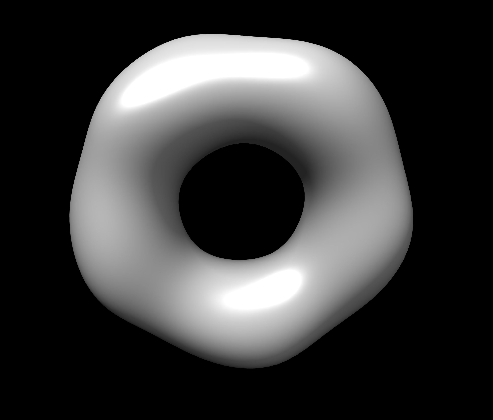
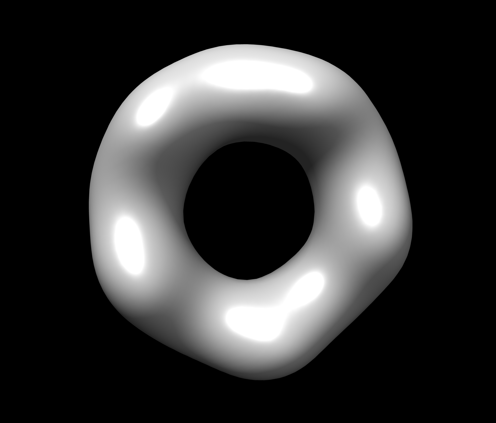
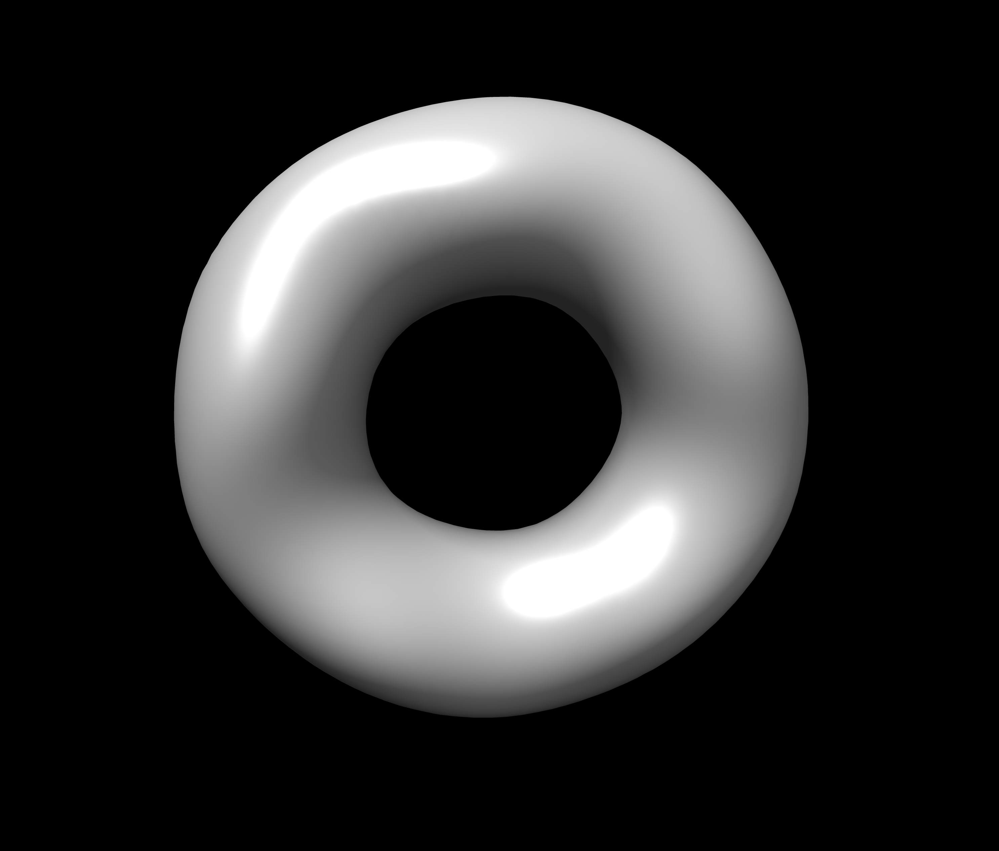

==============================
Command Line Document
==============================

Using SASTBX with console.

---------------------------
List of command line
---------------------------

+---------------------------+---------------------------+----------------------------------+
|     Command               | Command                   |  Command                         |
+===========================+===========================+==================================+
|  sastbx.superpose         | sastbx.collect_c2_results |  sastbx.generate_c2_parameters   |
+---------------------------+---------------------------+----------------------------------+
| sastbx.build_db           |  sastbx.fit_c2            |  sastbx.gpu_c2                   |              
+---------------------------+---------------------------+----------------------------------+
|   sastbx.buildmap         | sastbx.fxs_she            |  sastbx.image_simulator          |
+---------------------------+---------------------------+----------------------------------+ 
| sastbx.build_lookup_table | sastbx.fxs_znk            | sastbx.pr                        |
+---------------------------+---------------------------+----------------------------------+
|  sastbx.pregxs            |  sastbx.python            | sastbx.refine_i                  |
+---------------------------+---------------------------+----------------------------------+
|   sastbx.refine_pr        |   sastbx.refine_rb        |     sastbx.retrieval             |
+---------------------------+---------------------------+----------------------------------+
|   sastbx.run_c2_jobs      |    sastbx.sdp             |      sastbx.shapeup              |
+---------------------------+---------------------------+----------------------------------+
| sastbx.she                |   sastbx.show_build_path  |      sastbx.show_dist_paths      |
+---------------------------+---------------------------+----------------------------------+

You can type the command which you are interested in in the command line. And you can see a brief usage of the command.

-----------------------------------
Intensity Calculation (sastbx.she)
-----------------------------------

Obtain one-dimensional scattering curves of intensity versus scattering vector (I-q curves) from protein models.

Usage: ::

	sastbx.she model=mymodel structure=mystructure.pdb 
		experimental_data=myexperimentaldata.qis  
		pdblist=pdblist.txt  q_start=q_start q_stop=q_stop n_step=n_step output=outputfile

	Required arguments:
	 mystructure             the PDB file to be evaluated (must be provided)
 	Optional arguments:
	    mymodel                   default she        
	                              the model type to be used, it should be either debye or she 
	    myexperimentaldata.qis    default None       
	                              the sas profile, columns are q, I(q), and std
	    q_start                   default 0          
	                              start of Q array
	    q_stop                    default 0.5        
	                              end of Q arry
	    n_step                    defalut 51         
	                              Bin size 
	    outputfile                default output.iq  
	                              the file used to store computed sas profile and could be overwritten

*examples:* ::
	
	sastbx.she structure=/usr/test/Documents/mystructure.pdb
	sastbx.she structure=/usr/test/Documents/mystructure.pdb output=/usr/test/Documents/mystructure_she.iq

change the the file path `/usr/test/Documents/mystructure.pdb` to your own file path

----------------------------------
P(r) Estimation(sastbx.pregxs)
----------------------------------

Pair-distance distribution function determination

Usage: ::

	sastbx.pregxs data=data_file d_max=dmax scan=True/False output=output_prefix

parameters: ::

	required arguments:
    	data      q-intensity sigma
	Optional arguments:
	    d_max     default None                  Maximun distance in particle
	    scan      default False                 When True, a dmax scan will be preformed
	    output    default best.pr best.qii    

-----------------------------------------
Model Superposition(sastbx.superpose)
-----------------------------------------

Align models.

Usage: ::

	sastbx.superpose fix=fixed_file typef=type [pdb | nlm | map ] mov=moving_file typem=type nmax=nmax

parameters: ::

	required arguments:
     fix      default  None    pickle Cnlm coef of the fixed object
     mov      default  None    pickle Cnlm coef of the moving object
	optional arguments:
	 
	 typef     default PDB      fixed model type: pdb or nlm or map
	   
	 typem     default PDB      moving model type: pdb or nlm or map 
	 
	 num_grid  default 41       number of point in each euler angle dimension
	 rmax      default None     maxium radial distance to the C.o.M. (before the scaling)
	 nmax      default 20       maximum order of zernike polynomial:fixed for the existing database
	 topn      default 10       top N alignments will be further refined if required
	 refine    default True     Refine the initial alignments or not
	 write_map default False    write xplor map to file

example: ::

	sastbx.superpose fix=a.pdb mov=b.pdb

------------------------------------
Generate Database(sastbx.build_db)
------------------------------------

Creat database with a directory of PDB files.

Build your own database The default database used in the software is compiled using this script based on 10,733 models chosen from PISA

Usage: ::

	sastbx.python build_db.py path=path nmax=nmax fix_dx=True/False

parameters: ::
	path           default None          path of pdb files
	nmax           default 20            maximum order of zernike expansion
	fix_dx         default True          Whether keeping default dx=0.7A or not
	np             default 50            number of point covering [0,1]
	nprocess   	   default 4             number of processes
	prefix         defualt myDB      	 the prefix of pickle file names

*Attention:*
The *path* should be a directory that contains **only PDB files**.

examples:

For example, if there is a directory named pdb_models which contains 3D models in pdb format, and now I want to generate a database for these models. If I want the data to be stored in a directory named pdb_models( suppose that both the directories are in `/usr/test/Documents/`) and nmax=30, then I will write a command like this: ::
	
	sastbx.python path=/usr/test/Documents/pdb_models nmax=30

*result* ::
	
	myDB.codes 
	myDB.nlm 
	myDB.nn 
	myDB.rmax

or if you want to name the return files as “models”, then you can enter: ::

	sastbx.python build_db.py path=/usr/test/Documents/pdb_models prefix=/usr/test/Desktop/database/models

*result:* ::
	
	models.codes 
	models.nlm 
	models.nn 
	models.rmax

* .codes file records the PDB file’s name used in the database genetation.
* .nlm file records the 3D Zernike moments coeffcients.
* .nn file recoed the Hnn coeffcients.
* .rmax file contains the largest radius of each structure.

Data stored in these files are all in list format, and information for a specific model can be accessed with the same index.

-----------------------------------------------
Read the Contents of Database
-----------------------------------------------

Create a python script (here we use read.py as an example) and type the code ::

	from libtbx import easy_pickle
	prefix="/usr/test/Desktop/database/models"
	codes=easy_pickle.load(prefix+".codes")
	nlm_coefs=easy_pickle.load(prefix+".nlm")
	nn_coefs=easy_pickle.load(prefix+".nn")
	rmaxs=easy_pickle.load(prefix+".rmax")
	rmaxs=easy_pickle.load("~/database")
	
	#retrieval information for a specific model
	code="model_of_interest" #suppose the name of the model is "model_of_interest"
	indx=codes.index(code)
	nlm_coef=nlm_coefs[indx]
	nn_coef=nn_coefs[indx]
	rmax=rmaxs[indx]

change the prefix to the real path on your machine.

Then use sastbx.python to execute the script: ::
	
	sastbx.python read.py

-------------------------------------
Shape Search Engine(sastbx.shapeup)
-------------------------------------

sastbx.shapeup can be used for low-resolution shape determination given small angle scattering(SAXS) data. A search typically takes about one minute.  

Type ``sastbx.shapeup`` in the command line, a brief usage will be given:

::

  Usage: 

     sastbx.shapeup <target=target.iq> [rmax=rmax nmax=nmax scan=True*/False buildmap=True*/False pdb=pdbfile path=database_path]  

     The intensity profile is the only required input file  (in theory)  
     Optional control parameters: 

       rmax     : radius of the molecule (default: guessed from Rg)  
       nmax     : maximum order of the zernike polynomial expansion (<=20 for precomputed database; 10 is the default)  
       qmax     : maximum q value, beyond which the intensity profile will not be considered (default 0.20)  
       path     : path to the database (this MUST be correct to execute the searching)  
       buildmap : build electron density map in xplor format, all the map will be aligned  
       pdb      : any pdb model to be compared, and the maps will be aligned to the first pdb file  
       prefix   : the output prefix  

  query {  
    target = None  
      .help = "the experimental intensity profile"  
    nmax = 10  
      .help = "maximum order of zernike polynomial: FIXED for the existing"  
              "database"  
    pdb_files = None  
      .help = "If provided, align this structure to the models"  
    qmax = 0.2  
      .help = "maximum q value where data beyond are disgarded"  
    q_level = 0.01  
      .help = "ratio between I_stop and I_max"  
    q_background = None 
      .help = "the intensity beyond q-background is treated as background" 
    rmax = None
      .help = "estimated rmax of the molecule" 
    scan = True 
      .help = "scan for different rmax?" 
    prefix = "query" 
      .help = "the output prefix"  
    dbpath = None
      .help = "the directory of database file, i.e., the pickle files"
    db_choice = *pisa piqsi allpdb user
      .help = "Data base name"
    db_user_prefix = "mydb"
      .help = "the prefix of database filename"
    buildmap = True
      .help = "align the top models and generate xplor files"
    calc_cc = True
      .help = "calculate Correlation Coefficient or just Coefficient distance"
    smear = True
      .help = "smear the calculated data to remove the spikes (fits better to"
              "expt data)"
    weight = *i s
      .help = "the weights to be used in chi-score calculation"
    delta_q = None
      .help = "linear smearing distance, default is set to q_step*0.1"
    ntop = 10
      .help = "number of top hits returned per search"
    fraction = 0.9
      .help = "fraction in zernike moments calculation on 1-D axis: This is"
              "FIXED, unless the database is changed"
    scale_power = 4
      .help = "Parameter controlling the scale factor calculation. Default"
              "should be good."
  }

Further explanation about usage:    

In the current version, you need to specify the input intensity file and an estimated radius for a query. So the minimal command is in this format:  

``sastbx.shapeup target=input_file rmax=radius``

Other parameters are optional.  

*Here gives an example to illustrate the usage.*

The sastbx_path/source/sastbx/examples folder contains some iq profiles and the corresponding pdb data. Change to that directory, then type  
``sastbx.shapeup target=2e2g_znk.iq rmax=50``  

Radius and shape information are provided in the output.  

In this example, you can see from the output that:

::

  Best rmax found       :   74.15 A  

With no ntop specified, the output gives ten most similar models by default. Pairwise correlation coefficients are calculated and hierarchy clustering is performed with cutoff being 0.80. See this part of the output message:

::

    10 elements,    1 clusters, @cutoff=0.800000
  ( ( ( ( ( ( ( ( 4 3 ) 5 ) 1 ) ( 7 2 ) ) 8 ) 10 ) 9 ) 6 )
  mean_value, max_value, min_value, (max_value-min_value)
  0.929799741509 0.998779418237 0.825467887358 0.173311530879

It says that 10 models are returned and they form only one group.

The returned models are ranked by similarity to the target.  

::

  Rank PDB_code cc (to the given model or the first model):
  1 2ZCT
   2   2H66  0.956
   3   1QMV  0.987
   4   1UUL  0.985
   5   2PN8  0.985
   6   2FB5  0.856
   7   1E2Y  0.958
   8   1J93  0.945
   9   1U3D  0.916
  10   2OB9  0.947

Since no pdb files here, column three lists cc to the first model, pdb_code 2ZCT in this example.

A ccp4 file is generated for each returned model. And models within the same cluster are averaged to a map. You can use `chimera`_ to view the models. Here gives the images of the top 3 models, from left to right.

.. _chimera: https://www.cgl.ucsf.edu/chimera/

One can provide a pdb file and compare the returned models with it.

``sastbx.shapeup target=2e2g_znk.iq rmax=50 pdb=2e2g.pdb``

Now the output shows cc to the model given by the pdb file.

::

  Rank PDB_code cc (to the given model or the first model):
   1   2ZCT  0.997
   2   2H66  0.955
   3   1QMV  0.983
   4   1UUL  0.980
   5   2PN8  0.981
   6   2FB5  0.858
   7   1E2Y  0.956
   8   1J93  0.946
   9   1U3D  0.921
  10   2OB9  0.948

Similarity of the returned models to the target is implied by the high values of cc.

Compare the average_model(ave_1.ccp4, left) to the pdb file provided (2e2g.pdb, right):

  .. image:: ./images/image_ave_1.png
     :width: 30%
  .. image:: ./images/image_2e2gpdb.png
     :width: 30%

::

  Rmax: estimated vs PDB 74.1502812526 72.9867447533

